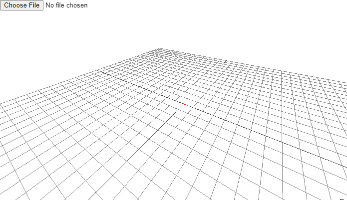

# ifcjs-101

Hello world example of IFC.js

This project is set-up by following the instruction provided in the IFC.js [Hello World documentation](https://ifcjs.github.io/info/docs/Hello%20world)

- This repo uses [web-ifc-three](https://ifcjs.github.io/info/docs/Guide/web-ifc-three/Introduction) which is a boilerplate 3D BIM Viewer with no in-built functionalities. You can use this if you want to build your own custom application with full control over the implementation.

- Also check-out [web-ifc-viewer](https://ifcjs.github.io/info/docs/Guide/web-ifc-viewer/Introduction) which is a 3D BIM viewer with many tools and functionalities already implemented (section drawings, dimensions, etc.), allowing you to create BIM tools with very little effort.

  - Check out [this repo](https://github.com/AnweshGangula/ifcjs-viewer-101) for basics

# Setting up the project (Pre-IFC.js)


### Install libraries

The first thing to do is to create an empty folder and start a new npm project with the command npm init. This will generate a package.json file containing some data such as the project name, version, commands and dependencies. In addition, the following dependencies must be installed with npm:

```bash
npm i web-ifc-three

npm i three

npm i rollup --save-dev
npm i @rollup/plugin-node-resolve --save-dev
```

### Index.html

The next step is to create an HTML file named index.html as the main document of the application. The HTML will have:

- A canvas element, used to render the Three.js scene.
- An input element, which will open IFC files from our computer to the application.
- A script referencing a file called bundle.js, which is the bundle of the app that we will produce with rollup.

```html
<!DOCTYPE html>
<html lang="en">
  <head>
    <meta charset="UTF-8" />
    <meta http-equiv="X-UA-Compatible" content="IE=edge" />
    <meta name="viewport" content="width=device-width, initial-scale=1.0" />
    <link rel="stylesheet" href="styles.css" />
    <title>Document</title>
  </head>
  <body>
    <input type="file" name="load" id="file-input" />
    <canvas id="three-canvas"></canvas>
    <script src="bundle.js"></script>
  </body>
</html>
```

### Adding style

The following CSS file will make the canvas full screen:

```css
* {
  margin: 0;
  padding: 0;
  box-sizing: border-box;
}

html,
body {
  overflow: hidden;
}

#three-canvas {
  position: fixed;
  top: 0;
  left: 0;
  outline: none;
}

#file-input {
  z-index: 1;
  position: absolute;
}
```

### Setting up a 3D scene

We are now going to create the JavaScript file to write the code for our application (eg: index.js). This file can be located anywhere and have any name, but you must reflect this in the `rollup.config.js` in the next step.

🧱 We are going to create a basic 3D scene using Three.js.

```javascript
import {
    AmbientLight,
    AxesHelper,
    DirectionalLight,
    GridHelper,
    PerspectiveCamera,
    Scene,
    WebGLRenderer,
  } from "three";
import {
    OrbitControls
  } from "three/examples/jsm/controls/OrbitControls";

//Creates the Three.js scene
const scene = new Scene();

//Object to store the size of the viewport
const size = {
    width: window.innerWidth,
    height: window.innerHeight,
};

//Creates the camera (point of view of the user)
const aspect = size.width / size.height;
const camera = new PerspectiveCamera(75, aspect);
camera.position.z = 15;
camera.position.y = 13;
camera.position.x = 8;

//Creates the lights of the scene
const lightColor = 0xffffff;

const ambientLight = new AmbientLight(lightColor, 0.5);
scene.add(ambientLight);

const directionalLight = new DirectionalLight(lightColor, 1);
directionalLight.position.set(0, 10, 0);
directionalLight.target.position.set(-5, 0, 0);
scene.add(directionalLight);
scene.add(directionalLight.target);

//Sets up the renderer, fetching the canvas of the HTML
const threeCanvas = document.getElementById("three-canvas");
const renderer = new WebGLRenderer({
    canvas: threeCanvas,
    alpha: true
});

renderer.setSize(size.width, size.height);
renderer.setPixelRatio(Math.min(window.devicePixelRatio, 2));

//Creates grids and axes in the scene
const grid = new GridHelper(50, 30);
scene.add(grid);

const axes = new AxesHelper();
axes.material.depthTest = false;
axes.renderOrder = 1;
scene.add(axes);

//Creates the orbit controls (to navigate the scene)
const controls = new OrbitControls(camera, threeCanvas);
controls.enableDamping = true;
controls.target.set(-2, 0, 0);

//Animation loop
const animate = () => {
    controls.update();
    renderer.render(scene, camera);
    requestAnimationFrame(animate);
};

animate();

//Adjust the viewport to the size of the browser
window.addEventListener("resize", () => {
    size.width = window.innerWidth;
    size.height = window.innerHeight;
    camera.aspect = size.width / size.height;
    camera.updateProjectionMatrix();
    renderer.setSize(size.width, size.height);
});
```

### Manual Bundling


> Note: At this point, we need to manually bundle this js file using any bundler.

You can bundle this file using any bundler. We are going to use [rollup](https://rollupjs.org/guide/en/#quick-start) to bundle this by using the following command:

```
npx rollup index.js -o bundle.js -f es -p @rollup/plugin-node-resolve
```

which is short for:

```
npx rollup index.js --file bundle.js --format es --plugin @rollup/plugin-node-resolve
```

### Bundling config

Next, we'll create the rollup configuration file to save the bundling configuration and run the file instead of typing the entire command each time. This file has to be called `rollup.config.js` and includes the reference to the plugins we have previously installed.

```javascript
import resolve from '@rollup/plugin-node-resolve';

export default {
  input: 'index.js',
  output: [
    {
      format: 'esm',
      file: 'bundle.js'
    },
  ],
  plugins: [
    resolve(),
  ]
};
```

Also, the `package.json` file needs to be modified to contain the commands to control rollup easily. In each command, you'll have to specify the relative path to your rollup configuration file. If we have installed everything correctly, we should see the same dependencies in this file (the version of the libraries may differ).

- `npm run build` will bundle the project and create a file called bundle.js in the root directory of the project.

- `npm run watch` will activate the watch mode, updating that file automatically every time we make changes to the code and save it.

```json
{
  "name": "example",
  "version": "1.0.0",
  "description": "-",
  "main": "app.js",
  "scripts": {
    "build": "rollup -c ./rollup.config.js",
    "watch": "rollup -w -c ./rollup.config.js"
  },
  "author": "",
  "license": "ISC",
  "devDependencies": {
    "@rollup/plugin-node-resolve": "^11.2.1",
    "rollup": "^2.45.2"
  },
  "dependencies": {
    "three": "^0.128.0",
    "web-ifc-three": "0.0.102"
  }
}
```

### Running the app

To run the application locally we will need a local server. If you are using VS Code as IDE, one option is to install the [Live Server extension](https://marketplace.visualstudio.com/items?itemName=ritwickdey.LiveServer), which allows us to open an instance of Google Chrome, run our web application and see the changes we make to the code in real-time.

And every time you make a change in the javascript (`index.js`), you need to re-build the code using `npm run build` so that the `bundle.js` gets updated with the changes.

> Alternatively, you can run `npm run watch` so that rollup automatically watches for changes and bundles the code for you.

--------------------------------------------------------------------------------

> Note that all the code above is a basic set-up of a three.js environment and does not contain any ifc.js implementation yet. Below steps is where we are going to interact with ifc.js and add it in the above three.js environment

## Setting up the project (IFC.js)

### WebAssembly

The next thing to do is to copy the web-ifc.wasm and `web-ifc-mt.wasm` files to a directory in your project. It can be found in `node_modules\web-ifc` (or `node_modules\three\examples\jsm\loaders\ifc` if you are only using Three's IFCLoader). We can copy them wherever we want; in this example, they will be copied to a folder called wasm in the root directory of the project.

These files are necessary because they contain the compiled C++ logic of [web-ifc](https://github.com/IFCjs/web-ifc), which is the parsing core to read and write IFC files with native speed.

> These files have to be served statically in your application. This might need different tweaks if you are using frameworks or libraries like React, Angular, Vue or Svelte.

### Loading IFC files (user-uploaded)

Finally, we will use IFC.js to load IFC files. This can be done by instantiating the loader and creating an event for when the user uploads an IFC file to the HTML input element.

```javascript
import { IFCLoader } from "web-ifc-three/IFCLoader";

// Sets up the IFC loading
const ifcLoader = new IFCLoader();

const input = document.getElementById("file-input");
input.addEventListener(
    "change",
    (changed) => {
        const file = changed.target.files[0];
        var ifcURL = URL.createObjectURL(file);
        ifcLoader.load(
            ifcURL,
            (ifcModel) => scene.add(ifcModel));
    },
    false
);
```

> Keep in mind that if you haven't saved the wasm files in the root of served files of the project, you'll need to specify its location with `setWasmPath`. For instance, if we had them stored in a folder called `wasm` contained in a folder called `static` in the root of the project, we would do the following:

> ```
> ifcLoader.ifcManager.setWasmPath("static/wasm/");
> ```




If you have done everything correctly, you should be able to see something similar to [this](https://ifcjs.github.io/hello-world/examples/web-ifc-three/helloworld/) in your local server. From here, the possibilities are endless.


## What else can I do with IFC.js?

This is just the beginning. You can take a look at [web-ifc-viewer](https://github.com/IFCjs/web-ifc-viewer), which includes tools for object selection, changing geometry appearance, section planes and much more. You can try it [here](https://ifcjs.github.io/web-ifc-viewer/example/index).

